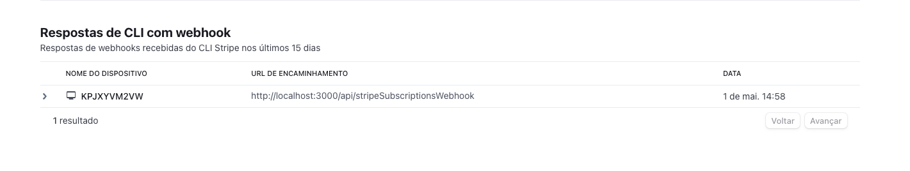

# Leonardo Rick Personal Portifolio

<a style="font-size: 2rem" href="https://leonardorick.com">It's alive! 🔗</a>
| Home |
| ----------------------------------------------------------------------------------------- |
|  |

## Setup

```bash
pnpm install
npm run dev
```

Make sure to check .env.example to check the necessary variables needed to run the probject.

### Note

This project is my experimental playground where I try out different things, so the structure and coding may not be as organized as you would expect in a real project.

In real life, we don't usually use so many different animations and implement the same thing in different ways. But here, I went all out and did everything I've always wanted to do!

The main focus here is on three things:

1. the amount of maintenance required in the code (this project is not meant to be constantly changed);
2. the number of developers working on the code (just me), and;
3. concentrating on what truly matters (perfectionism isn't always necessary).

If you're interested in checking out some well-structured code, take a look at my github and the [js-libs](https://github.com/LeonardoRick/js-libs) project where I create helper functions for my projects.

### Supported Browswers

- Chrome
- Firefox
- Safari

### Language Logic

Using only i18n route logic to control the language was a little bit bad for experience because I didn't wanted the user to go back to the start of the page everytime the language changes. So what I did was to use a combination of both query and path parameters. The query parameters takes precedence if defined.

The URL might end up very weird as /pt-BR (being translated to english) or /?locale=pt-BR being translate but I prefered that beacuse I could take the benefits of both approaches. Using the path route I'm able to generate the SSR version of the website for all routes and using the query parameter I can refresh the page without scrolling top.

### Cloudlfare

For reidrect rules to work, your endpoints must be with proxy enabled

- https://community.cloudflare.com/t/301-redirect-page-rule-not-working/591595/10

#### Test Prouction Deploy

1. Make sure to add `NITRO_PRESET=cloudflare_pages` on .env
2. run `npx nuxt build && npx wrangler pages dev dist`

### Known Bugs

- If you run the app in a small screen theres a hydration missmatch warning in the console because the generated pages uses the desktop header that don't appear in small screens. I guess it's not a bug but it's worth mentioning that it's normal to happen.
-

### Stripe

#### Configuration

- Configure client portal: Settings -> Billing -> Customer Portal

  - On Business Information: add redirect link to `http://localhost:3000/profile` in test and to `https://leonardorick.com/profile` in production
  - On Subscriptions: Enable "Customers can swith plan"
  - To test customer portal: `stripe billing_portal sessions create --customer cus_123456789`

- Configure payment link: Payments -> Payment Links -> Edit/Create -> After payment

  - Select Don't show confirmation page
  - Fill the input with `http://localhost:3000/login?stripe_checkout_id={CHECKOUT_SESSION_ID}`

- Configure subscriptions webhook: Developers -> Webhooks:
  - Endpoint URL: `https://staging.leonardorick.com/api/stripeSubscriptionsWebhook`
  - Events to send: `invoice.payment_succeeded`

#### Test stripe webhook

1. [Setup stripe cli](https://docs.stripe.com/stripe-cli)
2. [Create local listener](https://dashboard.stripe.com/test/webhooks/create?endpoint_location=local)
   1. `stripe login`
   2. `stripe listen --forward-to localhost:3000/api/stripeSubscriptionsWebhook`
3. Go to the payments link, fill email and card and perform a payment.
4. In stripe Dashboard go to the Developers --> Events.
5. Find your event `invoice.payment_succeeded` (theres usually two for payment: `invoice.paid` and `invoice.payment_succeeded`)
6. Scroll down and find CLI answers with webhook
   
7. Copy the body of the payload and paste on postman
8. Tweak your server to answer what you want and to develop the webhook

#### Test stripe customer portal

### Appwrite configuration

#### indexes

- users collection:
  - index_email: to find if user already exists before creating again
- allowed-emails:
  - index_email: to check if user is on allowed-emails on both login and signup
- previews:
  - index_number: to query previews based on number instead of fileId
- covers:
  - index_number: to query covers based on the number instead of fileId

#### Deleting a user manually

1. Delete from stripe
2. Delete from users Auth
3. Delete from users collection
4. Delete from allowed-email collection

#### types

- There's no array type so you select the type you wwant and them select if you want this to be an array.
- If you create an array there's no functionalitty on making it required because the default is always an empty array: https://discord.com/channels/564160730845151244/1090006380301275187

#### Upading database

In appwrite we can't block single properties in a collection to be updated so we just block all updates to the user database to avoid allowing the user to update itself wrongly. In this collection and in many others you should use the relative nuxt endpoint (created by us) that deals with updating the collection.
