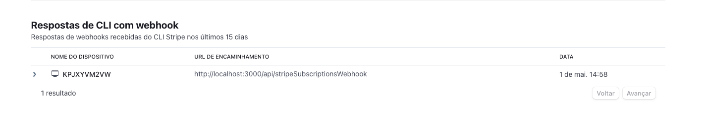

# Leonardo Rick Personal Portifolio

<a style="font-size: 2rem" href="https://leonardorick.com">It's alive! 🔗</a>
| Home |
| ----------------------------------------------------------------------------------------- |
|  |

## Setup

```bash
pnpm install
npm run dev
```

Make sure to check .env.example to check the necessary variables needed to run the probject.

## Mock

To run with mocked data make sure to the the .env variable `USE_MOCKS=true`.

Keep in mind that this will make `PAYLOAD_GRAPHQL_URL` to be ignored and some other endpoints are fake.

To setup more fake responses:

1. If the request is for nuxt backend, handle it in `01.mock.ts`
2. If it's an external API call, mock it in `mocks/handlers/index.ts`

To disable only the external mock, comment this part in `02.initializer.client`

```ts
if (isStringTrue(useMocks)) {
  const { worker } = useSetupMSWWorker();
  worker.start({ onUnhandledRequest: 'bypass' });
}
```

The songs audio files are not mocked but they are cached on indexedDB through localforage so if you need a new song to be added, update the metadata mocks and run once without the mocked data. Once the audio is loaded once you can add the mocks back.

### Note

This project is my experimental playground where I try out different things, so the structure and coding may not be as organized as you would expect in a real project.

In real life, we don't usually use so many different animations and implement the same thing in different ways. But here, I went all out and did everything I've always wanted to do!

The main focus here is on three things:

1. the amount of maintenance required in the code (this project is not meant to be constantly changed);
2. the number of developers working on the code (just me), and;
3. concentrating on what truly matters (perfectionism isn't always necessary).

If you're interested in checking out some well-structured code, take a look at my github and the [js-libs](https://github.com/LeonardoRick/js-libs) project where I create helper functions for my projects.

### Language Logic

Using only i18n route logic to control the language was a little bit bad for experience because I didn't wanted the user to go back to the start of the page everytime the language changes. So what I did was to use a combination of both query and path parameters. The query parameters takes precedence if defined.

The URL might end up very weird as /pt-BR (being translated to english) or /?locale=pt-BR being translate but I prefered that beacuse I could take the benefits of both approaches. Using the path route I'm able to generate the SSR version of the website for all routes and using the query parameter I can refresh the page without scrolling top.

### Hosting and deployment

The portfolio is prerendered, while `/api/*` still needs the Nuxt server for content, accounts, and subscriptions. Use `nuxt build`, not a static-only `nuxt generate` deployment. The project uses Node 24 and the pnpm version declared in `package.json`.

#### Vercel

Build the Vercel output locally with the required environment variables from `.env.example`:

```bash
NITRO_PRESET=vercel pnpm build
```

The output is `.vercel/output`, including static pages and a Node.js server function. `USE_MOCKS=true` is available for local build checks; never promote a mocked build to production. Vercel normally detects the preset automatically. Remove any `NITRO_PRESET=cloudflare_pages` override from Vercel's environment before deploying there.

Before moving the main domain:

1. Deploy the intended Git commit to Vercel and verify the portfolio, both languages, navigation, login, and music on the candidate deployment. Keep secrets in the hosting provider's environment settings.
2. Check Appwrite's allowed web origins and guest access to the public settings document. An Appwrite 403 is a separate configuration issue; changing hosts does not resolve it.
3. After approval, change the root and `www` DNS records to the targets Vercel specifies. Domain verification in Vercel alone does not change DNS. Leave email-related DNS records untouched.
4. Verify TLS, redirects, content, and server routes through the actual root domain. Keep the previous Cloudflare Pages deployment available for rollback until the cutover is verified.
5. Disable duplicate deployments or remove Pages custom domains only after explicit approval. Cloudflare DNS and email routing can remain in use without Pages.

#### Cloudflare Pages

For proxied Cloudflare redirect rules, the relevant DNS records must have proxying enabled. See [Cloudflare redirect troubleshooting](https://community.cloudflare.com/t/301-redirect-page-rule-not-working/591595/10).

To test the existing Pages target:

```bash
NITRO_PRESET=cloudflare_pages pnpm build
pnpm exec wrangler pages dev dist
```

#### Portfolio loading and performance

Keep the original progress bar, cube loader, model-readiness wait, and animated reveal. Performance work must preserve that sequence and the 3D R. The existing 10-second timeout remains a failure fallback, not the normal reveal path; graphics failures must not leave scrolling locked. Company and recommendation images use Nuxt Image's Cloudinary provider, so Cloudinary transformations and normal browser/CDN caching apply without manual downloads, blob URLs, or IPX. Error and unmatched routes skip the portfolio's CMS initialization.

### Known Bugs

- Pinia do not support Hot Reload out of the box and for adding it I would need to update the sintax of the stores and some of the logic to the "Options API" style, which I don't think is worth the effort. For further investigation, checks: https://pinia.vuejs.org/cookbook/hot-module-replacement.html#hmr-hot-module-replacement

### Mocks

If you want to work with mocks enable the environment variable `USE_MOCKS=true`.
To add more mocked endpoints check the `01.mock.ts` server middleware and add new urls to the map.

### Stripe

#### Configuration

- Configure client portal: Settings -> Billing -> Customer Portal

  - On Business Information: add redirect link to `http://localhost:3000/profile` in test and to `https://leonardorick.com/profile` in production
  - On Subscriptions: Enable "Customers can swith plan"
  - To test customer portal: `stripe billing_portal sessions create --customer cus_123456789`

- Configure payment link: Payments -> Payment Links -> Edit/Create -> After payment

  - Select Don't show confirmation page
  - Fill the input with `http://localhost:3000/login?stripe_checkout_id={CHECKOUT_SESSION_ID}`
  - Now under Settings -> Payments -> Checkouts and Payment Links
    - On the Subscriptions section enable "Limit customers to 1 subscription"
  - Obs: Currently I couldn't find a way to allow the user to select the currency so we leave it to stripe to get his location and offer the better currency out of the box.

- Configure subscriptions webhook: Developers -> Webhooks:

  - Endpoint URL: `https://staging.leonardorick.com/api/stripeSubscriptionsWebhook`
  - Events to send: `invoice.payment_succeeded`

- In Staging the Stripe Customer Portal and Payment links environment variables are not set/disabled so we don't allow the user to create Stripe subscriptions in staging.

#### Test stripe webhook

1. [Setup stripe cli](https://docs.stripe.com/stripe-cli)
2. [Create local listener](https://dashboard.stripe.com/test/webhooks/create?endpoint_location=local)
   1. `stripe login`
   2. `stripe listen --forward-to localhost:3000/api/stripeSubscriptionsWebhook`
3. Go to the payments link, fill email and card and perform a payment.
4. In stripe Dashboard go to the Developers --> Events.
5. Find your event `invoice.payment_succeeded` (theres usually two for payment: `invoice.paid` and `invoice.payment_succeeded`)
6. Scroll down and find CLI answers with webhook
   
7. Copy the body of the payload and paste on postman
8. Tweak your server to answer what you want and to develop the webhook

#### Test stripe customer portal

### Appwrite configuration

#### indexes

- users collection:
  - index_email: to find if user already exists before creating again
- allowed-emails:
  - index_email: to check if user is on allowed-emails on both login and signup
- previews:
  - index_number: to query previews based on number instead of fileId
- covers:
  - index_number: to query covers based on the number instead of fileId

#### Deleting a user manually

1. Delete from stripe
2. Delete all users sessions in Auth -> User -> Sessions
3. Delete from users Auth
4. Delete from users Collection
5. Delete from allowed-email collection

### Add a new preview

1. Upload the file in the storage
2. Create the item in the previews collection
3. Add the number in the settings collection (previewsReady)
4. Create the document in the upvotes collection where the document ID is the preview number
5. Optional: Update any user with the number in the availablePreviews if you want

#### types

- There's no array type so you select the type you wwant and them select if you want this to be an array.
- If you create an array there's no functionalitty on making it required because the default is always an empty array: https://discord.com/channels/564160730845151244/1090006380301275187

#### Upading database

In appwrite we can't block single properties in a collection to be updated so we just block all updates to the user database to avoid allowing the user to update itself wrongly. In this collection and in many others you should use the relative nuxt endpoint (created by us) that deals with updating the collection.
